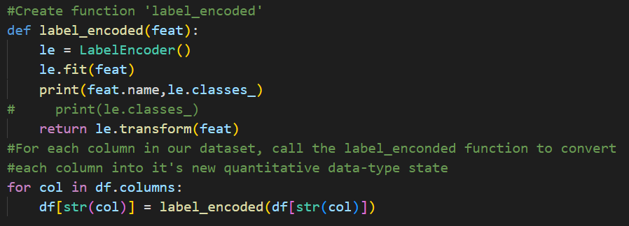
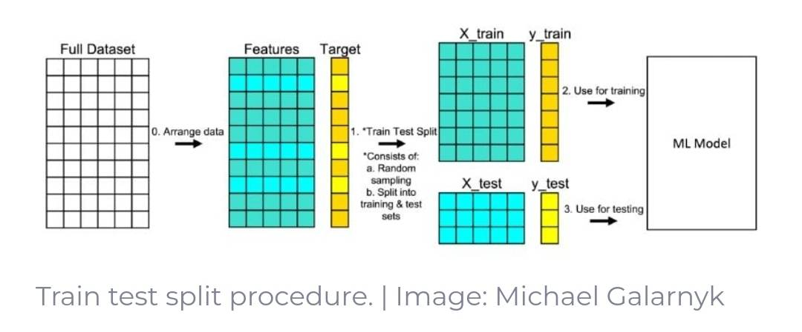
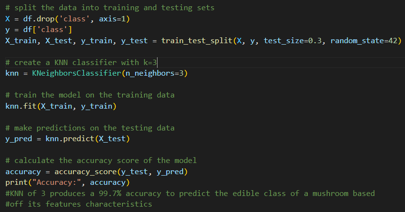
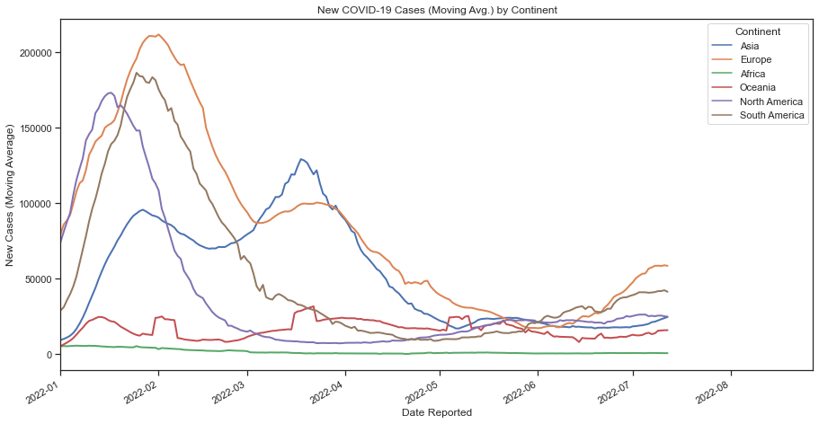

**Hi there!** - my name is Jordan and I'm a Senior Data Analyst at Salesforce. I'm currently a lead Tableau Developer for our Data Insights & Scalability team. My day typically involves developing and validating novel revenue metrics to monitor process improvement and automation efforts in Salesforce's Finance organization. Telling data stories is one of my many passions in life.

Another passion in my life is to follow a journey of continuous learning, both of myself and the world around me. I'd be happy to discuss my work experience and/or personal projects further - feel free to reach out to me on LinkedIn or via email. My resume is also available if you'd like to know more about my education and work history. To view each project, click the title of the project itself (dark blue text).

* [LinkedIn](https://www.linkedin.com/in/jordandavis0112/)

* [Resume](https://github.com/JdGithub0112/Jordans-Portfolio/blob/main/JordanDavis_Resume_2023.pdf)

* [Tableau Portfolio](https://public.tableau.com/app/profile/jordan.davis5657#!/?newProfile=&activeTab=0)

***

## [Python Competition: Predicting Hotel Cancellations](https://app.datacamp.com/workspace/w/8a3885d1-9e63-4b05-8bea-f7006c057ecf/edit)
### Predicting whether a hotel will be cancelled or not given its features
Performing data wrangling and exploratory analysis to understand correalations. Using XGBoost to predict whether a hotel will be cancelled or not with **85.5% accuracy** on this dataset.
)

## [Python Project: Mushroom Classification](https://github.com/JdGithub0112/Jordan-Davis-Python-Portfolio/tree/main/Python%20Projects)
### Predicting whether a mushroom is edible or poisonous based off its features
The goal of this classification Python project is to classify mushrooms as either edible or poisonous based on their physical characteristics. The project uses a dataset containing information about various physical attributes of mushrooms, such as cap shape, color, odor, stalk length, etc.

The project employs a classification algorithm (K Nearest Neighbors) from the scikit-learn (sklearn) library to train and evaluate the model on this mushroom dataset. The goal of the project is to build a model that can accurately (>=99.5%) classify mushrooms as either edible or poisonous based on their physical characteristics. Classification models have important practical applications in the field of mycology and public health, as it can help people to identify dangerous or potentially harmful mushrooms in the wild.

#### Exploring and Preparing our Data for Analysis
Label encoding is a technique for converting categorical data into numerical data by assigning a unique numerical value to each category. This is often done in machine learning tasks to prepare the data for modeling and is useful for correlation plots as seen below.

#### Understand correlations, if any - present in the dataset
By calculating the correlation between various physical attributes, such as cap size, stalk length, or gill spacing, and the mushroom's edibility or toxicity, we can determine which attributes are most strongly predictive of whether or not a mushroom is safe to eat. This information can be used to develop a classification model that accurately predicts a mushroom's edibility based on its physical characteristics.

#### Building Classification model using KNN begins with creating a training and testing split (70,30)

In order to test our model we'll have to split our dataset into a training (70% of the dataset) and testing (30% of the dataset) portions. This trains our model to obtain a better understanding of which mushrooms are edible or poisonous based off of the features associated. Then we 'test' our model on the remaining 30% of the unseen test data to access how accurate it can make its prediction of a mushroom being edible or not.

#### Final Result and Model Performance

When using a K-value of 5, the accuracy percentage output was 99.5%. Substituting the K-value to 3 yielded an accuracy percentage of **99.7%**

In general, a good classification model should have an accuracy that is significantly higher than the random chance level. For example, if there are two classes and the data is evenly distributed, the random chance level is 50%. In this case, a model that achieves an accuracy of 70% or higher would be considered good. In regards to mycology classification, 99.7% may not be sufficient - but for a basic classification model it is quite accurate.

---

## [Python Project: COVID-19 Cases Data Analysis & Visualization](https://github.com/JdGithub0112/Jordan-Davis-Python-Portfolio/tree/main/Python%20Projects)
##### Wrangling, joining, and cleaning World Health Organization Data for analysis and visualization

In this project I wanted to demonstrate my competency on using Pandas for organizing and cleaning my data to end up with a data frame for analysis. In this scenario, I wanted to learn how to scrape data from the web to have up-to-date information for my plots. The data in question comes from the World Health Organization and displays Covid cases/deaths data since early 2020 (cadence for update is everyday).

I began my exploratory data analysis by web scraping data from The [World Health Organization's website](https://covid19.who.int/data). I used the urllib library to pass through the csv data hosted on the WHO site to a csv file in my current file path where my Python script lived. I also web scraped data from the [Statistics Times Website](https://statisticstimes.com/geography/countries-by-continents.php) for country data so that I could add Continent data to my data frame.

In order to merge the two tables, I performed a left join on the 'Country' field alongside some general formatting to prep for the data visualization process. Lastly, I used the Seaborn library to plot New Covid-19 Cases (Moving Avg.) across the date they were reported by Continent.

