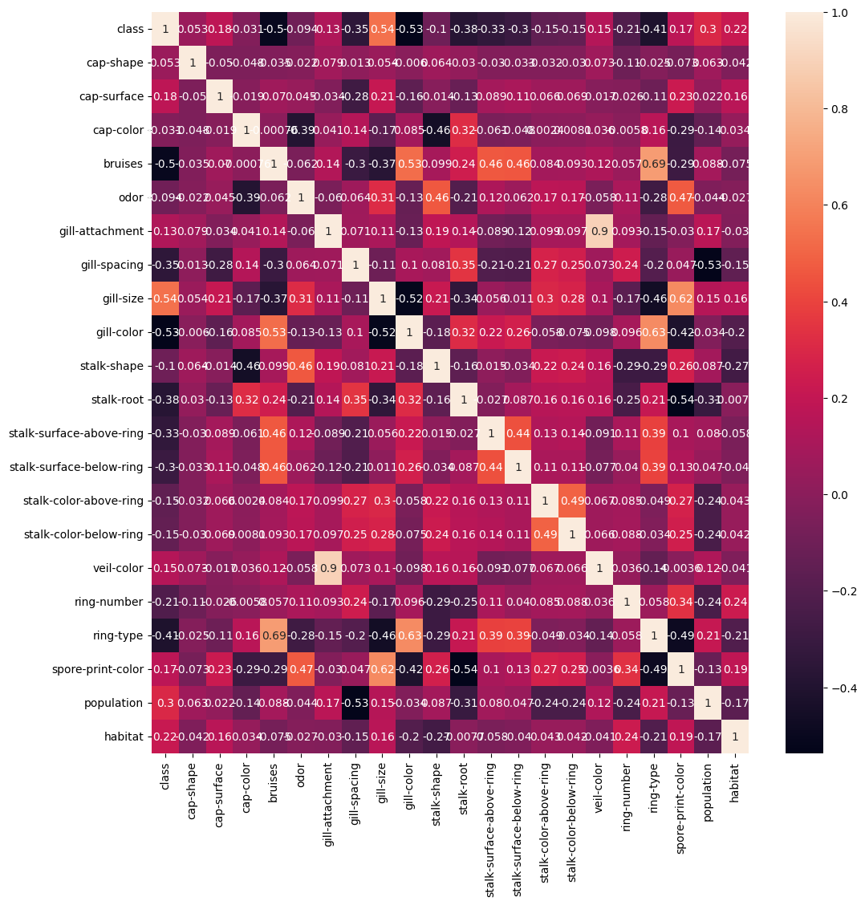

**Hi there!** - my name is Jordan and I'm a Senior Data Analyst at Salesforce. I'm currently the lead Tableau Developer for our Data Insights & Scalability team. My day typically involves developing and validating novel reveneue metrics to monitor process improvement and automation efforts. Telling data stories is one of my many passions in life. Below are a few python projects that I have worked on.

Another passion in my life is to follow a journey of continuous learning, both of myself and the world around me. I'd be happy to discuss my work experience and/or personal projects further - feel free to reach out to me on LinkedIn. My resume is also available if you'd like to know more about my education and work history.

* [LinkedIn](https://www.linkedin.com/in/jordandavis0112/)

* [Resume](https://github.com/JdGithub0112/Jordans-Portfolio/blob/main/JordanDavis_Resume_2023.pdf)

* [Tableau Portfolio](https://public.tableau.com/app/profile/jordan.davis5657#!/?newProfile=&activeTab=0)

***

## [Python Project: Mushroom Classification](https://github.com/JdGithub0112/Jordans-Portfolio/blob/main/Python%20Projects/mushroom_Classification.py)
### *Predicting whether or not a mushroom is edible or not based off of certain charecteristics: Exploratory Data Analysis and Classification*

In this project I performed exploratory data analysis as well as transcription of data elements to analyze correlation. The goal will be able to classify a test set of mushrooms that are either edible or not given their charecteristics.

## [Python Project: COVID-19 Cases Data Analysis & Visualization](https://github.com/JdGithub0112/Jordans-Portfolio/blob/main/Python%20Projects/Covid-19_CaseData.py)
##### *Wrangling, joining, and cleaning World Health Organization Data for analysis and visualization*
##### *Leveraging Pandas and NumPy Python Libraries*
In this project I wanted to demonstrate my contempency on using Pandas for organizing and cleaning my data to end up with a dataframe for analysis. In this scenario, I wanted to learn how to scrape data from the web to have up-to-date information for my plots. The data in question comes from the World Health Organization and displays Covid cases/deaths data since early 2020 (cadence for update is everyday).

I began my explaratory data analysis by web scraping data from The [World Health Organization's website](https://covid19.who.int/data). I used the urllib library to pass through the csv data hosted on the WHO site to a csv file in my current file path where my Python script lived. I also web scraped data from the [Statistics Times Website](https://statisticstimes.com/geography/countries-by-continents.php) for country data so that I could add Continent data to my dataframe.

In oder to merge the two tables, I performed a left join on the 'Country' field alongside some general formatting to prep for the data visualization process. Lastly, I used the Seaborn library to plot New Covid-19 Cases (Moving Avg.) across the date they were reported by Continent.

